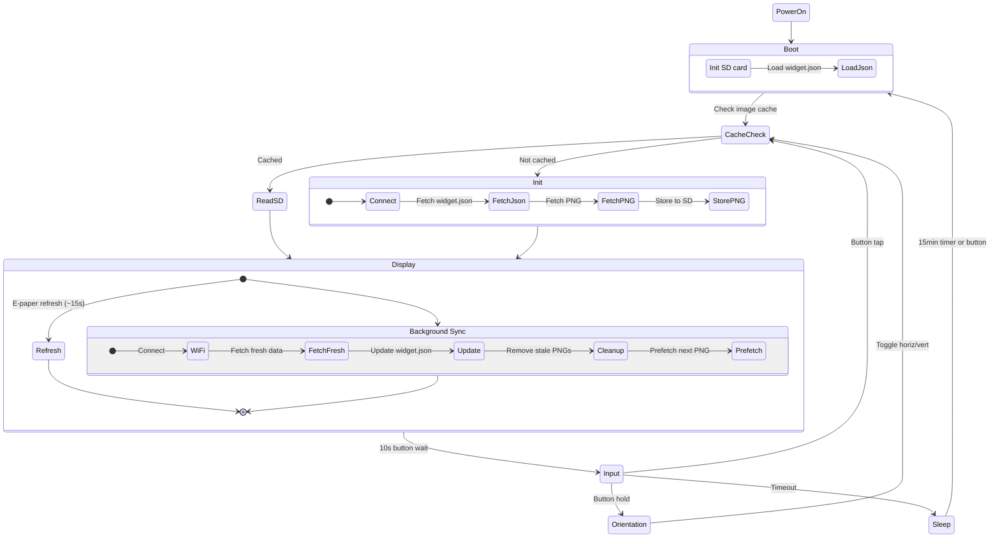
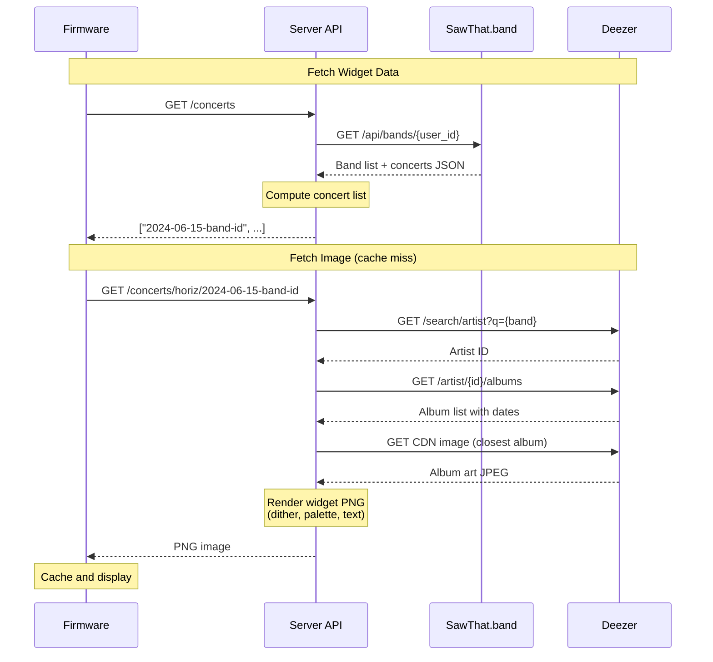

# SawThat Frame

E-paper display frame for concert/album art data pulled from [sawthat.band](https://sawthat.band).

Built on the [Waveshare ESP32-S3-PhotoPainter](https://www.amazon.com/dp/B0FWRJD8HZ):
- 7.3" Spectra 6 color e-paper display
- ESP32-S3 with wifi and ble
- SDMMC reader with included 16GB sdcard
- GPIO Buttons and LEDs
- (unused) Speaker, microphones

## Examples

### Physical Device


### API Outputs


## Usage

### Requirements

- Rustup
- Espup
- Espflash

A nix dev shell can be used for all required build tools:

```bash
nix develop
```

### Running the server

The server provides the widget API for data fetching and image processing

#### From source

```bash
cd server
PORT=3000 cargo run -r
```

#### Using nix

```bash
nix run .
```

#### NixOS Module

For nixos systems, a module is provided to run the server as a systemd service.
Add the following flake input and NixOS configuration:

```nix
{
  inputs.sawthat-frame.url = "github:ozwaldorf/sawthat-frame";

  outputs = { nixpkgs, sawthat-frame, ... }: {
    nixosConfigurations.myhost = nixpkgs.lib.nixosSystem {
      modules = [
        sawthat-frame.nixosModules.default
        {
          services.sawthat-frame-server = {
            enable = true;
            port = 3000;
            openFirewall = true;
            logLevel = "info";
          };
        }
      ];
    };
  };
}
```

### Firmware

The firmware runs on the ESP32-S3 and drives the e-paper display.

#### Prerequisites

Install the ESP Rust toolchain using [espup](https://github.com/esp-rs/espup):

```bash
espup install
source ~/export-esp.sh
```

#### Configuration

Set WiFi credentials and server address via environment variables:

```bash
export WIFI_SSID="your-ssid"
export WIFI_PASS="your-password"
export SERVER_URL="http://192.168.1.42:3000"
```

#### Build and flash

Flash the firmware to the device and connect to the serial console:

```bash
cd firmware
cargo run --release
```

#### Button Controls

The KEY button controls navigation and orientation:

| Action | Duration | Effect |
|--------|----------|--------|
| Tap | >= 50ms | Next item |
| Hold | >= 500ms | Toggle orientation (horizontal/vertical) |

Button input is detected in two places:
- **On wake**: Immediately after waking from deep sleep (button or timer)
- **Post-display**: 10-second window after each display refresh

LED feedback:
- **Green LED**: 1 flash = next item, 3 flashes = orientation changed
- **Red LED**: Solid = idle, blinking = network activity, fast blink = WiFi connecting

### SD Card Cache

The firmware uses an optional SD card for caching. If no SD card is present, the firmware falls back to fetching everything from the network on each boot.

#### Directory Structure

```
/concerts/
  WIDGET.JSN          # JSON array of item paths
  ORIENT.DAT          # Orientation state (1 byte: 0=horizontal, 1=vertical)
  horiz/
    {hash}.PNG        # Horizontal orientation images (400x480 each)
  vert/
    {hash}.PNG        # Vertical orientation images (480x800)
```

Image filenames are 8-character hex hashes of the item path (FAT 8.3 compatible).

#### What Gets Cached

| Data | File | Purpose |
|------|------|---------|
| Widget items | `WIDGET.JSN` | List of concert IDs to display |
| Orientation | `ORIENT.DAT` | Persists orientation across power cycles |
| Images | `horiz/*.PNG`, `vert/*.PNG` | Pre-rendered e-paper images |

#### Cache Behavior

- **Boot**: Load widget data and orientation from SD card if available
- **Cache hit**: Read PNG directly from SD card (skips WiFi entirely)
- **Cache miss**: Fetch from server, store to SD card for next time
- **Background sync**: While display refreshes, fetch fresh widget data and prefetch next image
- **Cleanup**: When widget data changes, stale images are automatically deleted

## Specifications

### Firmware Lifecycle



### Network Interactions



### Image Processing Pipeline

The server transforms source images into 6-color indexed PNGs for the e-paper display:

1. **Resize**: Cover-fit with center crop (400×360 horizontal, 480×680 vertical)
2. **Tone adjustments**: Exposure (×0.8), saturation boost (×2.0), and S-curve for mid-tones
3. **Canvas composition**: Image area with gradient blend into solid background for text
4. **Dithering**: Floyd-Steinberg error diffusion in OKLab color space to 6-color palette
5. **Text rendering**: Concert info (band, date, venue) with adaptive font sizing
6. **PNG encode**: Indexed color output with embedded palette
