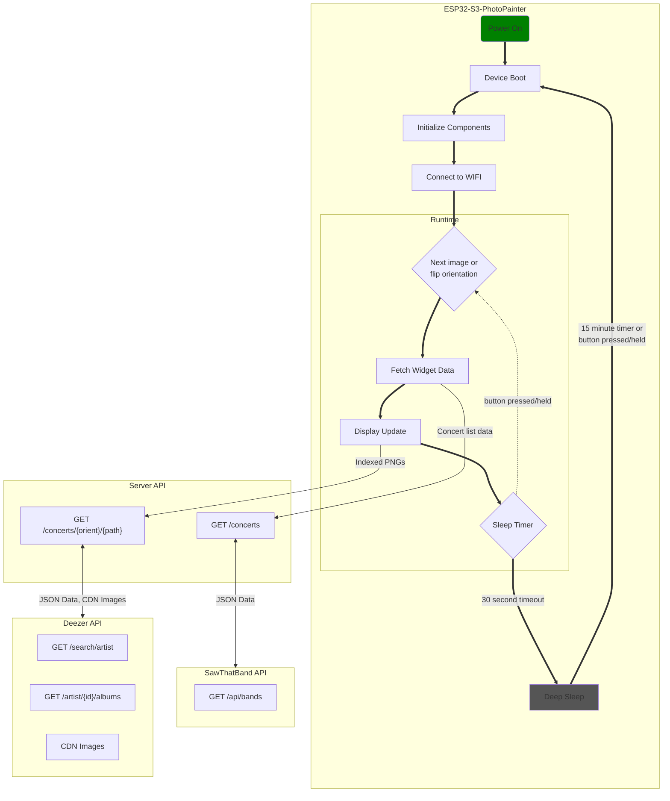

# SawThat Frame

E-paper display frame for concert/album art data pulled from [sawthat.band](https://sawthat.band).

Built on the [Waveshare ESP32-S3-PhotoPainter](https://www.amazon.com/dp/B0FWRJD8HZ):
- 7.3" Spectra 6 color e-paper display
- ESP32S3 with wifi and ble
- 16MB Flash
- GPIO Buttons and LEDs
- (unused) Speaker, microphones

## Examples

### Physical Device


### API Examples


## Usage

### Requirements

- Rustup
- Espup
- Espflash

A nix dev shell can be used for all required build tools:

```bash
nix develop
```

### Running the server

The server provides the widget API for data fetching and image processing

#### From source

The server can be ran from 

```bash
cd server
PORT=3000 cargo run -r
```

#### Using nix

```bash
nix run .
```

#### NixOS Module

For nixos systems, a module is provided to run the server as a systemd service. 
Add the following flake input and NixOS configuration:

```nix
{
  inputs.sawthat-frame.url = "github:ozwaldorf/sawthat-frame";

  outputs = { nixpkgs, sawthat-frame, ... }: {
    nixosConfigurations.myhost = nixpkgs.lib.nixosSystem {
      modules = [
        sawthat-frame.nixosModules.default
        {
          services.sawthat-frame-server = {
            enable = true;
            port = 3000;
            openFirewall = true;
            logLevel = "info";
          };
        }
      ];
    };
  };
}
```

### Firmware

The firmware runs on the ESP32-S3 and drives the e-paper display.

#### Prerequisites

Install the ESP Rust toolchain using [espup](https://github.com/esp-rs/espup):

```bash
espup install
source ~/export-esp.sh
```

#### Configuration

Set WiFi credentials and server address via environment variables:

```bash
export WIFI_SSID="your-ssid"
export WIFI_PASS="your-password"
export SERVER_URL="http://192.168.1.42:3000"
```

#### Build and flash

Flash the firmware to the device and connect to the serial console:

```bash
cd firmware
cargo run --release
```

## Project Lifecycle


